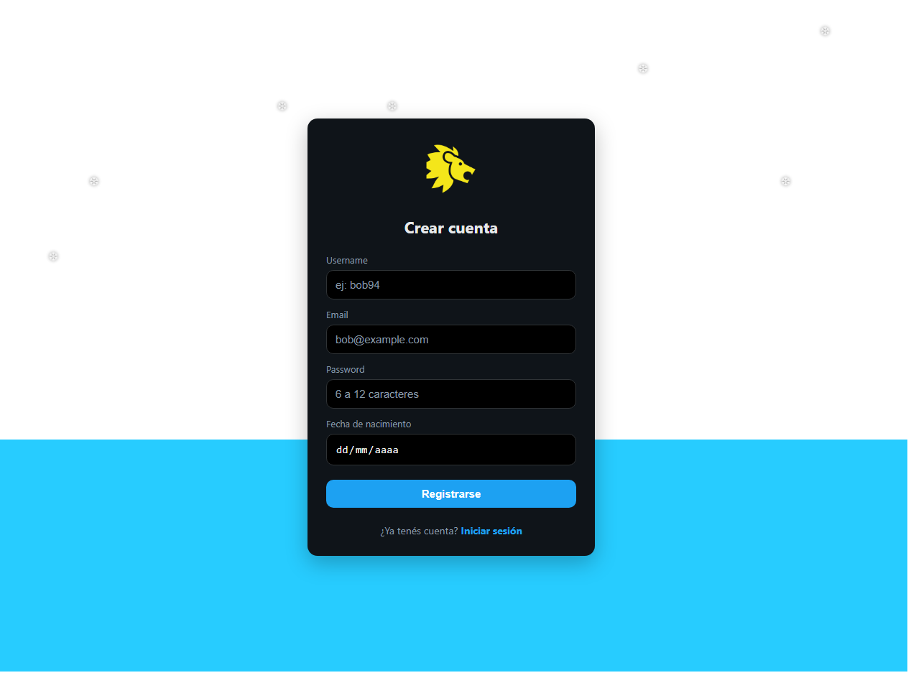
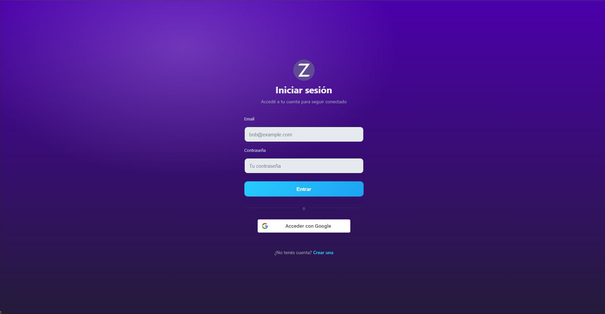
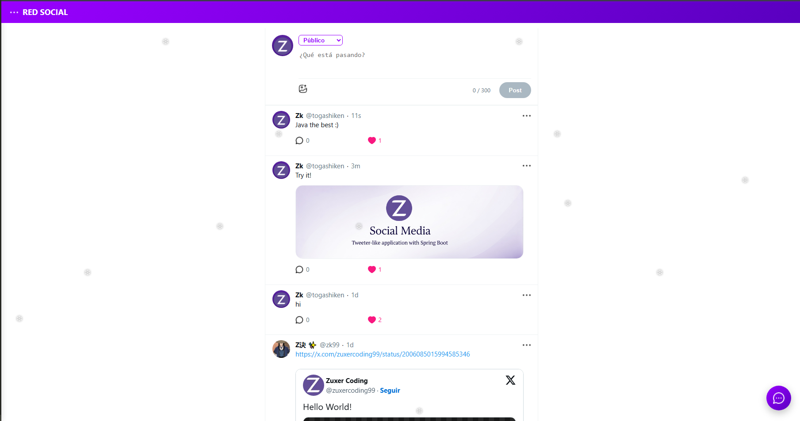

# Social Media Platform – Spring Boot & Vanilla Frontend

**A full-stack social media application** built as a personal project to demonstrate my skills in backend development with **Spring Boot 3 and HTML, CSS and Vanilla JS.** This app enables users to register, post content with privacy controls, like and comment on posts, engage in real-time chat, and customize profiles with themes and avatars. Designed with a focus on security, performance, and scalability, it's ready for cloud deployment.

This project highlights my ability to build a complete application from scratch, leveraging AI-assisted development to accelerate frontend implementation efficiently, even with foundational knowledge in UI design and frontend programming. I'm eager to secure my first software engineering role—let's connect!

---

## Features

- **User Authentication:** Secure registration and login using JWT tokens, with role-based access (user/admin).
- **Posts & Feed:** Create posts with text, images, and privacy levels (public, friends, private); paginated feed, likes, and comments.
- **Profiles:** Customizable user profiles including bio, avatar uploads, birthdate, and theme modes (light/dark).
- **Real-Time Chat:** Public chat room via WebSockets (STOMP), with support for private messaging.
- **Media Handling:** Image uploads for posts and avatars (5MB limit), previews, and lightbox viewer.
- **Themes & Effects:** Persistent light/dark modes using CSS variables, responsive design, and subtle animations like snowflake effects.
- **Security & Performance:** Rate limiting, caching, password hashing (BCrypt), configurable CORS, and monitoring via Actuator.
- **Admin Tools:** Automatic admin user seeding on startup, with Prometheus metrics exposure.
- **Database Migrations:** Managed in production via Flyway, ensuring smooth, versioned schema updates.
- **CI/CD:** Fully automated build and deployment pipeline using GitHub Actions, ready for cloud deployment.

---

## Tech Stack

### Backend

- **Java 17** – Main language
- **Spring Boot 3.5.x** – Core framework
- **Spring Web (REST API)** – Controllers and endpoints
- **Spring Data JPA** – ORM and database handling
- **Spring Security + JWT (jjwt)** – Auth & role-based access
- **Bean Validation (Jakarta Validation)** – Data validation
- **Spring WebSocket** – Real-time communication
- **Spring Cache + Caffeine** – Cache in local memory
- **Bucket4j** – Rate limiting (protection against abuse)
- **Spring Actuator** – Metrics and health checks
- **Micrometer + Prometheus** – Observability
- **Springdoc OpenAPI** – API documentation (Swagger UI)
- **Apache Tika** – File analysis and validation
- **Flyway** – Production-ready DB migrations

### Database

- **H2** – Development
- **PostgreSQL** – Production
- **Hibernate (JPA Provider)** – ORM

### Testing

- **JUnit 5**
- **Spring Boot Test**

### Build & Config

- **Gradle**
- **Profiles (dev / test / prod)**
- **Environment variables ready for cloud deployment**
- **CI/CD pipeline via GitHub Actions**

---

## Frontend

- **HTML5 & CSS3 (responsive, dark/light mode)**
- **Vanilla JavaScript**
- **Fetch API for backend communication**
- **State handling in browser (localStorage)**

## Security Highlights

- JWT authentication
- Role-based endpoint protection
- Ownership validation (only owner can modify/delete resources)
- Proper HTTP error handling (401, 403, 404)
- Rate limiting by IP

---

## Funcionalidades Principales

- User registration & login
- Post with content and media creation, viewing, deletion and like
- Comment system
- Friend relationships between users
- Permission control per user
- Persistent dark/light theme
- Real-time chat via WebSockets
- Interactive API documentation with Swagger

---

## Local Setup

### Backend

```bash
./gradlew build bootRun
```

Default active profile:

```text
dev
```

### Frontend

Use a local server (e.g., Live Server).

---

## API Documentation

Disponible en:

```text
/swagger-ui.html
```

---

## Cloud Deployment

- Prepared for any cloud deployment with docker
- Supports environment-specific profiles and production database

🔗 **Demo Online:**
(Takes few minutes the backend to start because it's a free one)

> [https://social-media-with-springboot-frontend.onrender.com/](https://social-media-with-springboot-frontend.onrender.com/)

---

## Roadmap / Future Enhancements

- Expanded integration tests
- Notifications system
- External image storage (S3)

---

## 👨‍💻 Author

Developed by **zuxercoding99**

Focus: Backend & Full-Stack Java

## Contact

- Email: zkcoding99@gmail.com
- LinkedIn: https://www.linkedin.com/in/ezequiel-zk993213/

---

⭐ Si este proyecto te resulta interesante, ¡no dudes en dejar una estrella!

## 📸 Capturas







